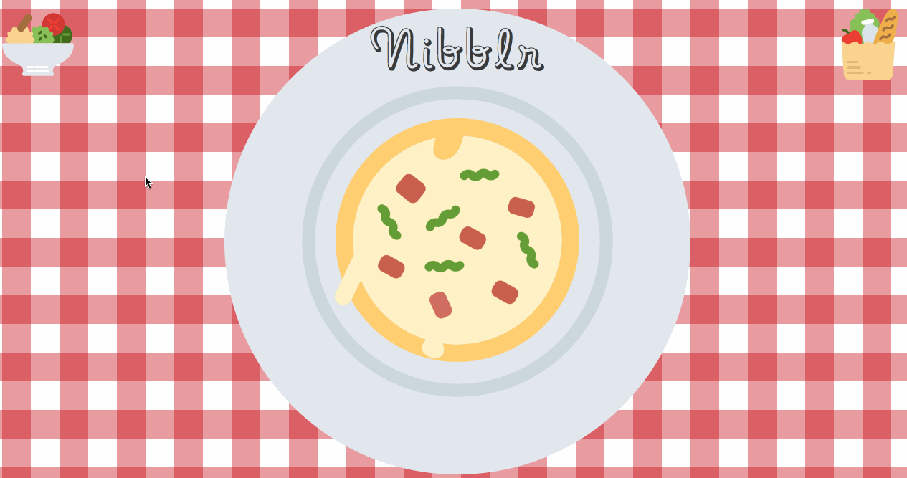

# This is 🍜 🍕 Nibblr 🌮 🍔



I am "Tinder for Take-Out"

## How to use

* Visit me at: https://tinder-for-takeout.herokuapp.com
* Click on the salad bowl in the top left corner to reveal your choices
* Once your nearby food images load, swipe left on 'yucks' and swipe right on 'yums'
* Click on the grocery bag to scroll through your selections

## Configuration on local machine

Create a GitHub repo and clone it. After you have a repo on your machine:

```sh
npm install

create a secrets directory with a file that contains your own Google Places and Clarifai API keys

npm dev-start
```

App will be running on localhost:3000

And then you'll have me! If I change – which I probably will – you can get the most recent
version by doing this again:

```sh
git fetch nibblr
git merge nibblr/master
```

## My anatomy

`/src` has the React setup. `index.jsx` is the entry point.

`/server` has node files.

`/public` has all visual assets

## Conventions

I use `require` and `module.exports` in `.js` files.

I use `import` and `export` in `.jsx` files

I use two spaces, no semi-colons, and generally prefer a less strict version of
[NPM's funny coding style](https://docs.npmjs.com/misc/coding-style).

## Licensing
This software is protected under the standard MIT License.
